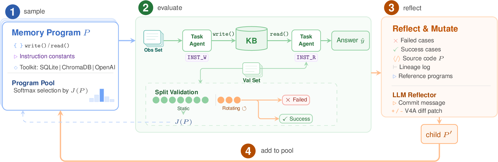
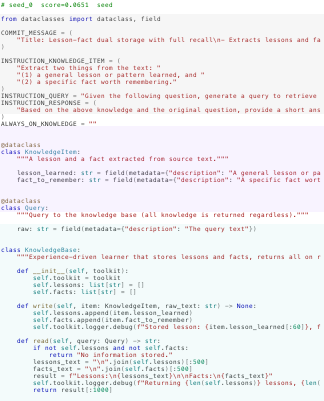
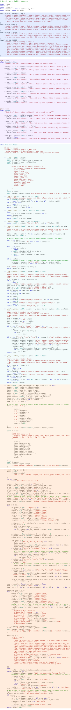
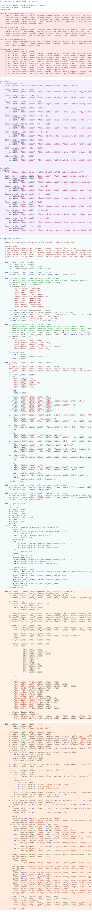

<div align="center">

# M★: Every Task Deserves Its Own Memory Harness

**Automatically discovering a task-optimized memory harness for each LLM task via reflective code evolution.**

[](https://mstar.wenbo.io)
[](https://www.python.org/downloads/)
[](LICENSE)
[](#quick-start)
[](https://arxiv.org/abs/2604.11811)

</div>

LLM agents need memory to store what they have seen and retrieve it when needed.
Everyone hand-designs these systems: pick a vector store, write some retrieval logic, tune the prompts, ship it.
This project automates the design process.
You provide a benchmark; it evolves a task-specific memory system as executable Python code.
The memory it discovers for conversational QA looks nothing like what it discovers for a household robot.
Both emerge from the same three simple seeds.

<p align="center">
  
</p>

## The idea

A memory system is expressed as a *memory program* — a Python module with three jointly-optimized dimensions: Schema (dataclasses defining what to store and how to query), Logic (`write()`/`read()` backend), and Instruction (prompt constants that steer the task agent).
In the code, this is the `KBProgram` (defining `KnowledgeItem`, `Query`, and `KnowledgeBase`); in the paper it is called the *memory program* or *memory harness* — they are the same thing.
The evolution loop starts from 3 seeds, evaluates programs on a benchmark (scoring against a static validation set and using a rotating set for reflection), asks an LLM reflector to mutate the code (V4A patch), compiles and fixes errors, then adds the child to the population pool.
After 20 iterations, the best program is evaluated on the held-out test set.

The task agent that *uses* the memory is completely fixed.
Only the memory program evolves.
If the score improves, the memory got better.

## What evolution finds

A seed program starts at roughly 30 lines. After 20 iterations, the system discovers structurally different solutions for different tasks:

<table>
<tr>
<td align="center"><b>Seed</b><br>(30 lines)</td>
<td align="center"><b>LoCoMo (Conversational QA)</b><br>(200+ lines)</td>
<td align="center"><b>ALFWorld (Embodied Tasks)</b><br>(200+ lines)</td>
</tr>
<tr>
<td></td>
<td></td>
<td></td>
</tr>
<tr>
<td>Dump everything,<br>retrieve everything</td>
<td>Multi-table SQL, temporal decay,<br>entity indexing, semantic fusion</td>
<td>Deterministic action cache,<br>zero LLM calls at retrieval</td>
</tr>
</table>

## How it works

```
src/mstar/seeds/        3 starting programs (vector search, LLM summarizer, experience learner)
src/.../evolution/      evaluate → reflect → mutate → repeat
src/.../benchmarks/     LoCoMo, ALFWorld, HealthBench, PRBench (+ auxiliary: mini_locomo, kv_memory, …)
```

Each iteration: sample a parent from the pool (softmax on scores), reflect on its failures, produce a mutated child, evaluate, add to pool.
The toolkit available to evolved programs includes SQLite, ChromaDB, and a budget-limited LLM (1 call per read/write by default; configurable via `--toolkit-budget`).
`read()` and `write()` calls each have a 60-second timeout; `read()` output is capped at 3,000 characters.

## Quick start

Python 3.12+, [uv](https://docs.astral.sh/uv/), an API key (e.g. `OPENROUTER_API_KEY` or `AZURE_API_KEY`).

```bash
git clone https://github.com/wbopan/mstar.git
cd mstar
uv pip install -e ".[dev]"

# run tests (no API key needed)
uv run pytest tests/evolution/ -m "not llm" -v

# evolve a memory system (needs API key)
uv run python -m mstar.evolution \
  --dataset mini_locomo --iterations 3 --no-weave

# evaluate a single program without evolution
uv run python -m mstar.evolution \
  --dataset mini_locomo --seed-program src/mstar/seeds/vector_search.py \
  --iterations 0 --no-weave
```

ALFWorld is included as a core dependency — no extra install step needed. Use `--dataset alfworld` directly.

### Reproducing the paper

The paper's results (arXiv:2604.11811) were produced with specific Azure-hosted models. To reproduce them, run:

```bash
bash scripts/run_experiments.sh
```

This sets task/toolkit model = `azure/gpt-5.4-mini`, reflector = `azure/gpt-5.3-codex` (thinking effort medium), and embeddings = `openrouter/baai/bge-m3`. You can override models via environment variables — see the script header for details.

> **Warning:** The bare-CLI defaults use `openrouter/deepseek/deepseek-v3.2` (task/toolkit) and `openrouter/openai/gpt-5.3-codex` (reflector). These differ from the paper's Azure models and will **not** reproduce the published numbers.

See `scripts/README.md` for a full reproduction guide (complete walkthrough of all runs, environment setup, and result collection).

## What a memory program looks like

```python
INSTRUCTION_KNOWLEDGE_ITEM = "Summarize the key information from the text."
INSTRUCTION_QUERY = "Formulate a query to search for relevant information."
INSTRUCTION_RESPONSE = "Based on the knowledge, provide a short answer."
ALWAYS_ON_KNOWLEDGE = ""

@dataclass
class KnowledgeItem:
    summary: str

@dataclass
class Query:
    query_text: str

class KnowledgeBase:
    def __init__(self, toolkit):    # toolkit = SQLite + ChromaDB + LLM
        self.collection = toolkit.chroma.get_or_create_collection("kb")

    def write(self, item, raw_text=""):
        self.collection.add(documents=[item.summary], ids=[...])

    def read(self, query):
        results = self.collection.query(query_texts=[query.query_text], n_results=5)
        return "\n".join(results["documents"][0])
```

## Project structure

```
src/mstar/
  evolution/        core loop, evaluator, reflector, sandbox, toolkit, types
  benchmarks/       dataset integrations
  baselines/        no-memory and vanilla-RAG
  seeds/            3 starting programs (vector_search.py, llm_summarizer.py, experience_learner.py)
  logging/          experiment tracking, output management
scripts/            experiment scripts (run_experiments.sh + reproduction guide)
tests/              test suite (disk-cached, runs without API keys)
```

## Citation

```bibtex
@misc{pan2025mstar,
  title        = {M{\ensuremath{\star}}: Every Task Deserves Its Own Memory Harness},
  author       = {Wenbo Pan and Shujie Liu and Xiangyang Zhou and Shiwei Zhang and
                  Wanlu Shi and Mirror Xu and Xiaohua Jia},
  year         = {2025},
  eprint       = {2604.11811},
  archivePrefix= {arXiv},
  primaryClass = {cs.AI},
  url          = {https://arxiv.org/abs/2604.11811},
  note         = {Preprint, under review}
}
```

## License

Apache 2.0
